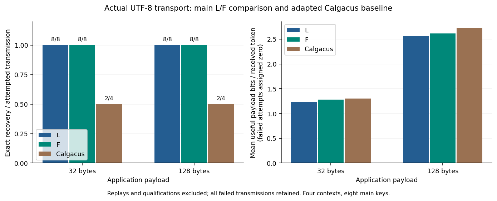
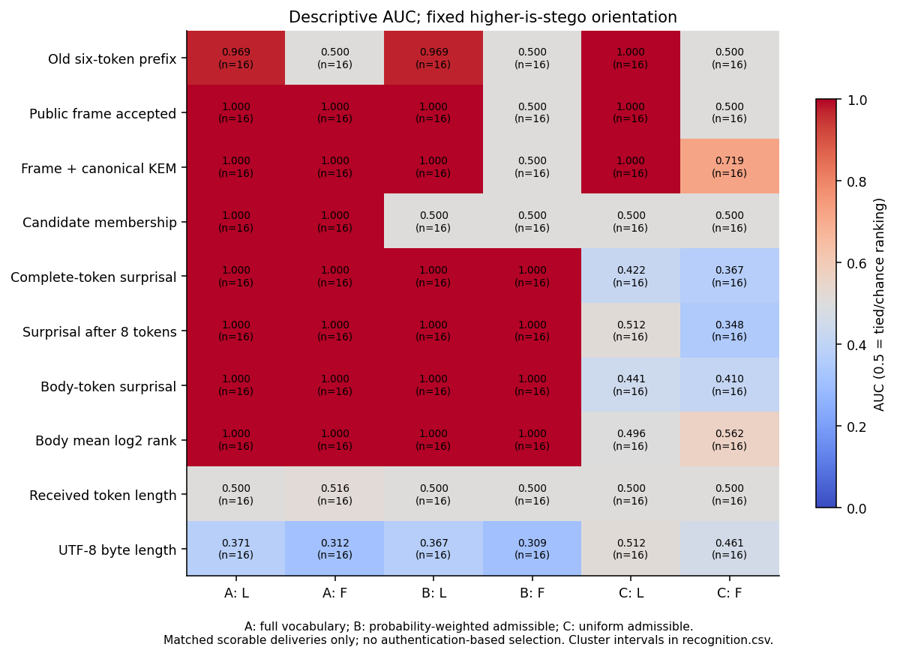
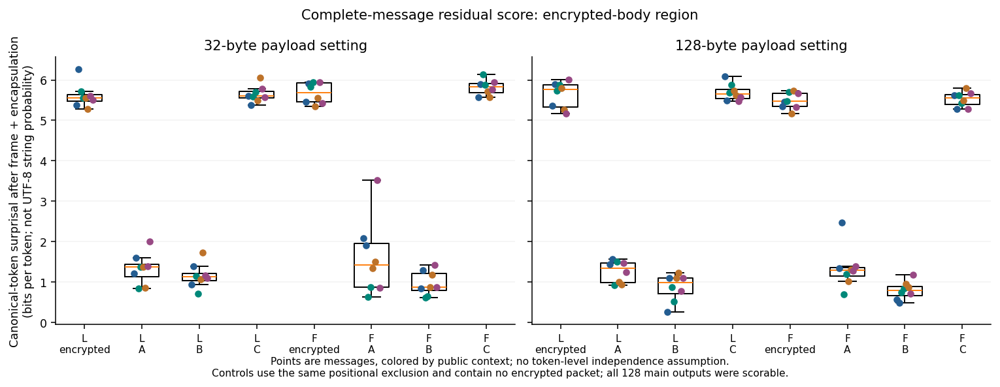
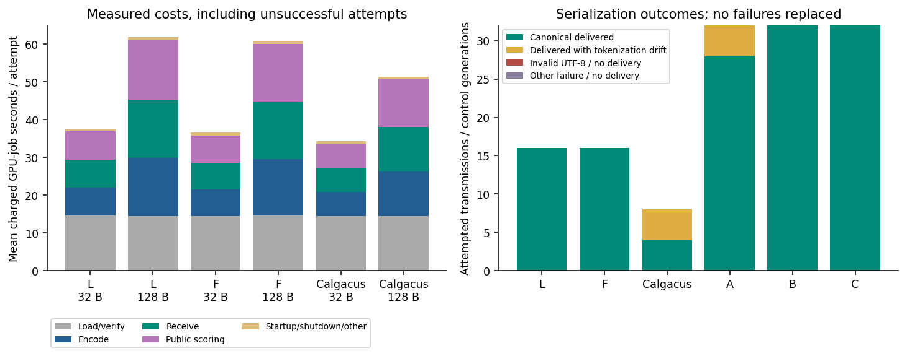

# Stage 6: Framing, Recovery, and Public Recognition in LLM-Based Encrypted Text Transport

**The bounded study completed all 150 scheduled attempts. L and F each recovered 16/16 main messages from actual UTF-8, and all eight independent receiver replays recovered exactly. Removing L's outer header removed its predictable prefix but did not establish concealment.** Complete-message recognition depended strongly on the cover generator: body-surprisal AUC was 1.000 against ordinary and probability-weighted admissible controls, but 0.410 for F against uniform-admissible controls. A separate public encapsulation-representation test still distinguished F from those uniform controls at descriptive AUC 0.719.

The adapted Calgacus baseline recovered **2/4 at each payload size**, with four retained tokenization-drift failures. Four ordinary controls also drifted on retokenization; their valid received text remained in every applicable observer comparison. There were no invalid-UTF-8 outputs, capacity aborts, unexplained numerical failures, timeouts, lease failures or selective retries. Inference has stopped; no Stage 7 or larger matrix was launched.

This strengthens a narrowly specified empirical case study. It does **not** establish novelty, operational detector accuracy, concealment, sender authentication, edit robustness or a new encryption primitive. The underlying framing and distribution principles are established. A distinctive regular-paper contribution remains provisional.

## Authority, source and evidence boundary

Authorized on **18 September 2026**, directly on `main` in [mantzaris/CalgacusPublicEncryption](https://github.com/mantzaris/CalgacusPublicEncryption). Starting revision was **`f51f38c22367aeae4dd728e37f4c092435ad0e14`**, with a clean working tree. Every GPU attempt used **`404904dfd9d8a44212db1bc42ba1a54a83cbb48c`**, committed with the implementation, allocation, profiles, test keys and analysis specification before inference. That revision was also pushed during execution. Host analysis and this report were added later; they are not mislabelled as GPU-tested code.

The user's Stage 6 instruction authorizes a different next step from the historical [Stage 5 assessment](STAGE5_CONTRIBUTION_DECISION.md). Internal CARTS/RankCloak/ImageCalgacus manuscript reconciliation was set aside as an execution prerequisite. No manuscripts were requested, no internal-version review was reopened, and no historical assessment was rewritten. Attribution and public-prior-work limits remain in [stage6_claims.md](docs/stage6_claims.md) and the existing [source review](docs/related_work_sources.md).

The [frozen specification](docs/stage6_study_spec.md), [allocation](artifacts/stage6/allocation.json), [summary](artifacts/stage6/summary.json), [immutable attempt records](artifacts/stage6/cases.jsonl) and [evidence manifest](manifests/stage6_evidence.json) connect results to exact configurations, commands, source revision, wire bytes, public traces, worker identities and ledger entries. This is prospective exploratory data, **not final held-out evaluation**. Qualifications are development-only; all earlier stages remain development evidence and are not pooled into these observations.

## Implemented comparison

L reuses the existing rank16 codec unchanged: a four-byte unsigned big-endian envelope length followed by the raw HPKE envelope. F adds [InferredRank16Codec](src/llm_stego_public_key/codecs/inferred_rank16.py), which directly inherits the **same candidate-selection function** and encodes the envelope without that outer field. New, explicitly registered [Stage 6 profiles](configs/stage6/) bind the changed context inventory and each method's policy. Historical profiles and both historical codecs are unchanged.

Both methods select a high-nibble-first symbol from the first 16 eligible tokens among at most the top 128, using descending float32 logits and ascending token-ID ties. Each admitted complete prefix must be strict UTF-8 and retokenize exactly to its proposed IDs. Model precision, cache clearing, serial batching, vocabulary order, 2048-token context and 512-token transport ceiling are unchanged. No normalization, filtering repair, radix change or parameter search occurred.

F receives only transmitted bytes, agreed public configuration/context and the private key through the receiver interface. It bounds bytes before tokenization, requires canonical bytes and an **even 136–392 token count**, infers **68–196 envelope bytes** before allocating the recovered buffer, and rejects invalid candidate choices. The message boundary is the received byte-string boundary. Empty payloads still need 68 envelope bytes; maximum 128-byte payloads need 196. Odd or out-of-range truncation/appending fails framing; an even alteration within the permitted range can pass public syntax but must still authenticate, including the protected inner payload length, before delivery.

HPKE remains pyhpke **0.6.5**, Base mode, X25519/HKDF-SHA256, HKDF-SHA256 and ChaCha20-Poly1305. The inner record remains a random 16-byte identifier, u32be payload length and payload, without padding. The existing `Binding.info` and `aad` bind the complete intended public profile and selected context. L and F pair payload/key/context but use independent fresh encapsulations and message IDs; no ciphertext crosses incompatible bindings. All nine recipient keys are explicitly generated **TEST_ONLY fixtures**; eight serve the main matrix and one serves qualification. Published fixture keys cannot protect real secrets. HPKE Base mode does not authenticate a sender: another public sender can create a fresh valid ciphertext, which is not an AEAD forgery.

F still exposes length. With this no-padding packet, its received token count gives a candidate envelope length and payload length. Removing the header removes a public consistency constraint, not length information. Correctness remains conditional on reproducible logits, tokenizer behavior, candidate ordering and sufficient admissible candidates. None of that is a concealment proof.

## Frozen study and verification

Four new harmless contexts concern a brass compass, wooden-chair repair, waves around a stone pier and apple sorting. Their exact strings, deterministic SHAKE256 binary-payload formulas, balanced key assignment `2*context+repetition`, control seeds and counterbalanced L/F order are frozen in the allocation. Contexts were not selected from favorable outcomes. Cryptographic randomness used the established OS/library generators, independently of the reproducibility PRNG.

| Stratum | Planned / attempted | Outcome |
|---|---:|---|
| Public predictions and F boundary qualification | 6 / 6 | Four independent public zero-path predictions; exact empty- and maximum-payload recovery |
| Main L/F encrypted transmissions | 32 / 32 | 32 exact authenticated recoveries, eight independent main recipient keys |
| A/B/C full-message controls | 96 / 96 | All delivered and scorable; 92 canonical, four ordinary-control retokenization changes |
| Audited adapted Calgacus baseline | 8 / 8 | Four exact recoveries; four drift failures |
| Independent fresh-process receivers | 8 / 8 | Eight exact recoveries; two per variant/payload-size cell |
| Unallocated investigation allowance | 10 unused | No retries, warmup-only jobs, replacement cases or additional experiments |

The independent receivers were predetermined from contexts 0 and 2, repetition zero. Their worker inputs contain the saved carrier path, public profile/context and test private key, with no encoder IDs/ranks, expected payload/hash/length or saved cache. Payload-hash comparison occurs outside the receiver. These eight checks are repeated reconstruction, not eight new transmissions or an anti-replay-cache experiment.

[Eleven focused CPU checks](artifacts/stage6/focused_checks.txt) passed in 0.734 seconds before the GPU freeze: independent nibble/inverse expectations, even/bounded lengths, malformed text/ranks, empty/maximum authenticated payloads, changed-profile authentication, truncation/appending, public-only observer inputs, unchanged candidate/sampling functions and accounting extension/lock/restart/rollback boundaries. The [allocation check](artifacts/stage6/allocation_check.txt) verified all full reservations and conservative token bounds. Earlier cryptographic known-answer results retain their original revisions; no broad test suite, lint/formatting sweep, CPU model inference or benchmark was run. One host allocation check ran before its input file had been prepared and failed; its output is retained, with no inference or ledger charge.

## Recovery, expansion and useful rate

| Method | Payload bytes | Exact / attempted | Received carrier tokens | Mean successful bits/token | Mean useful bits/token over attempts | Recovered bytes / charged second |
|---|---:|---:|---:|---:|---:|---:|
| L | 32 | 8/8 | 208 | 1.2308 | 1.2308 | 0.8506 |
| F | 32 | 8/8 | 200 | 1.2800 | 1.2800 | 0.8758 |
| L | 128 | 8/8 | 400 | 2.5600 | 2.5600 | 2.0709 |
| F | 128 | 8/8 | 392 | 2.6122 | 2.6122 | 2.1072 |
| Adapted Calgacus | 32 | 2/4 | 95–102 | 2.6023 | 1.3011 | 0.4669 |
| Adapted Calgacus | 128 | 2/4 | 184–193 | 5.4355 | 2.7177 | 1.2466 |

Failed attempts receive zero useful rate in the attempt mean. The last column includes every encrypted job's loading, encoding, reception and public scoring, including failures; it excludes separate controls and replay jobs. Aggregate recovered-bits/delivered-token ratios are separately retained in [recovery.csv](artifacts/stage6/recovery.csv), rather than conflated with means of ratios.

F's analytical eight-token saving is **3.846% of L's 32-byte carrier and 2% of its 128-byte carrier**. Measured UTF-8 byte ranges were L: 797–1144 / 1595–2090 and F: 658–970 / 1198–1824 for 32/128-byte payloads. Carrier bytes are variable, even at a fixed token count. The baseline's successful carriers are more compact, and its attempt-mean bits/token slightly exceed F here despite 50% recovery. F provides better observed recovery and recovered bytes per charged job-second; it does not dominate every efficiency definition.



All four baseline failures first diverge at the actual text boundary. Token positions are zero-based; complete expected/actual IDs, conditional-rank divergences and receiver errors are retained in [failures.json](artifacts/stage6/failures.json).

| Baseline case | First changed received token | Subsequent receiver outcome |
|---|---:|---|
| `Calgacus-c0-n32` | 97 | HPKE authentication rejection |
| `Calgacus-c1-n128` | 10 | Invalid Base64 length |
| `Calgacus-c3-n32` | 48 | Invalid Base64 |
| `Calgacus-c3-n128` | 106 | Invalid Base64 length |

These are serialization-caused failures, not unexplained numerical failures or breaks of HPKE. All four carriers were delivered as valid UTF-8 and publicly scored. The four ordinary-control drifts occur in F-matched settings at positions 35, 192, 34 and 318; one changes the received count from 392 to 390. Controls are not encrypted F carriers: their method label identifies matched configuration/length, and these observations do not show that F's encoder drifted. No original failed attempt was repaired, retried or erased.

## Public recognition from received text

The public observer starts with actual UTF-8, public model/tokenizer/profile/context, recipient public key and a separately computed public L-prefix prediction. It receives no private key, payload, expected length, encoder trace or authentication outcome. One complete cover-scoring pass provides candidate membership, full-vocabulary ranks and canonical-token surprisal. Public Calgacus inversion also needs a separately metered source reconstruction. The observer never authenticates a tag. Canonical-token surprisal is a token-path score, not the exact probability of a transmitted UTF-8 string; alternative latent tokenizations and the observed A-control drifts matter.

A samples the full vocabulary at temperature one. B samples proportionally within the same 16 admissible candidates. C samples those candidates uniformly. Each attempts its matched fixed token count; EOS is an ordinary token rather than an early stop, with no replacement after serialization problems. B/C add no packet or encryption. These are different full-message **model generators**, not interchangeable approximations to human cover traffic.

Every main carrier and control was delivered and scorable, so all **16 matched pairs per variant/family** enter each AUC. The four drifted controls are included. There was no completion-based exclusion or authentication-based selection in this realized matrix. The frozen contract would keep aborted attempts separately from wire-only comparisons: an internal sender abort is not automatically an observable wire event.

| Variant | Cover family | Old-prefix AUC | Frame AUC | Frame + KEM AUC | Body-surprisal AUC | Token-length AUC | UTF-8-byte-length AUC |
|---|---|---:|---:|---:|---:|---:|---:|
| L | A: ordinary | 0.969 | 1.000 | 1.000 | 1.000 | 0.500 | 0.371 |
| F | A: ordinary | 0.500 | 1.000 | 1.000 | 1.000 | 0.516 | 0.312 |
| L | B: weighted admissible | 0.969 | 1.000 | 1.000 | 1.000 | 0.500 | 0.367 |
| F | B: weighted admissible | 0.500 | 0.500 | 0.500 | 1.000 | 0.500 | 0.309 |
| L | C: uniform admissible | 1.000 | 1.000 | 1.000 | 0.441 | 0.500 | 0.512 |
| F | C: uniform admissible | 0.500 | 0.500 | 0.719 | 0.410 | 0.500 | 0.461 |

All scores retain the predeclared **higher-is-stego** orientation, including below-chance results; directions were not flipped. A below-0.5 byte-length AUC still indicates reverse-direction ranking information, not absence of a length signal. No claim of independent predictive value after conditioning on both token count and byte length is made. Full score distributions, rank statistics, context-specific AUCs and intervals are in [recognition.json](artifacts/stage6/recognition.json), [recognition.csv](artifacts/stage6/recognition.csv) and [paired differences](artifacts/stage6/paired_differences.json).

The observations separate three mechanisms:

- **Expected framing consequence:** all 16 L prefixes match the public six-zero prediction; none of the 16 F prefixes does. One L-matched A and one L-matched B control also match, so a prefix match is not proof of ciphertext. L's complete frame accepts none of its 48 controls. F's complete frame accepts all 16 B and all 16 C controls, but no A controls. Membership is perfect for both encrypted methods and B/C, while every A control has at least one nonmember.
- **Residual selection-distribution signal:** complete and body-token surprisal/rank scores separate encrypted carriers from A/B in this sample. Excluding L's first 72 or F's first 64 tokens removes the outer header, if present, and the 32-byte encapsulation region. The same positional exclusion is applied to controls, which contain no actual encrypted body. Mean body surprisal is 5.623 bits/token for L and 5.581 for F, versus A/B means between 0.878 and 1.461. This signal remains past the removed header at matched intended token lengths. Byte length also carries some ranking information; no stronger causal independence claim is warranted.
- **Residual public envelope structure:** all F envelopes pass `u < 2**255-19` for the little-endian first 32 bytes. Only **9/16 F-matched C controls** pass, compared with **16/16 B controls**. Thus the representation predicate contributes a gap against C but not B in these records. It recognizes a necessary honest-sender X25519 output convention, not a valid curve point, HPKE tag or sender. The complete envelope is not assumed uniform merely because its body is encrypted.

The encapsulation check follows [RFC 7748 §5](https://www.rfc-editor.org/rfc/rfc7748.html#section-5) and [RFC 9180 §§4.1/7.1.1](https://www.rfc-editor.org/rfc/rfc9180.html#section-7.1.1), alongside inspection of the frozen pyhpke raw-public-key serialization. Noncanonical input acceptance by an X25519 receiver is a different issue. For an ideal uniform 32-byte string, the predicate accepts `(2**255-19)/2**256`, approximately one half. Applying that ideal calculation to completion-conditioned carriers requires the stated generator/abort assumptions; the observed 9/16 is not a general false-positive estimate.



Against C, F's format-plus-KEM AUC is **0.71875**, with hierarchical bootstrap interval **[0.59375, 0.84375]**; its four context AUCs are 0.625, 0.625, 0.750 and 0.875. Body-surprisal AUC is **0.41016 [0.17949, 0.60938]**, versus L's **0.44141 [0.15615, 0.76563]**. The paired F-minus-L body-AUC difference is **−0.03125 [−0.39063, 0.27344]**: these data do not establish a body-score change caused by the framing ablation. The corresponding format-plus-KEM change is **−0.28125 [−0.40625, −0.15625]**, while still leaving a public recognition signal.

Intervals use the frozen 2000 hierarchical draws, seed 2026091866: resample four contexts, then two repetition/key groups, keeping sizes, variants and controls together. They are descriptive intervals for a small selected set, not a population guarantee. All-success recovery and complete-separation AUC intervals collapse; that does not prove perfect reliability or detection. Tokens, qualifications and replays are not independent main observations. Neither low nor below-chance body AUC establishes concealment against C, especially given the retained structural predicate.



## Hardware, inclusive cost and accounting

Rediscovery and every worker verified **NVIDIA RTX 5000 Ada Generation**, UUID `GPU-10d1f16f-9e79-08bb-b2ba-3353c04422cf`, **32760 MiB**, driver **590.48.01**. The other attached Quadro T2000 was not used. All **150 distinct worker PIDs** have matched GPU samples, clean exits, valid leases, matching source provenance and verified phase meters; logs show **33/33 layers offloaded**. Peak sampled process memory was **5006 MiB** (about 4.89 GiB), not a continuously measured maximum.

The reused profile is Meta-Llama-3-8B-Instruct Q4_K_M, llama-cpp-python **0.3.23**, CUDA runtime **12.4.127**, cuBLAS **12.4.5.8**, NumPy **2.2.6**, Python **3.10.13**, Linux **6.17.0-22-generic**. Native libraries, CUDA libraries and dependencies are hashed in [environment.json](artifacts/stage6/environment.json); [local_runtime.json](configs/local_runtime.json) retains the working sibling-environment paths. Model SHA-256 is `86c8ea6c8b755687d0b723176fcd0b2411ef80533d23e2a5030f845d13ab2db7`; tokenizer SHA-256 is `5c8950bef385be95db5feda8c8afadba6a5c0b903e6ceaa39efe6cfe3d84f3f3`. No models were downloaded and no backend was rebuilt.

| Main method / payload | Mean encoding seconds | Mean reception seconds | Mean public scoring seconds | Mean full job seconds |
|---|---:|---:|---:|---:|
| L / 32 | 7.373 | 7.336 | 7.592 | 37.620 |
| F / 32 | 7.050 | 7.014 | 7.265 | 36.540 |
| L / 128 | 15.407 | 15.367 | 15.865 | 61.808 |
| F / 128 | 15.026 | 14.985 | 15.454 | 60.745 |

F saved about 1.1 charged seconds per encrypted job here; this is a measured difference with independently randomized carriers, not a universal latency guarantee. Fresh receivers took 22.394–30.430 seconds including startup. Baseline jobs averaged 34.270 / 51.339 seconds at 32/128 bytes, including failed attempts. Control and replay breakdowns are retained in [costs.csv](artifacts/stage6/costs.csv).

Across all metered phases, candidate selection examined **1,314,286 IDs over 81,953 steps**: mean **16.037**, maximum **27**, with no unavailable candidate set. Rejections comprised 2802 noncanonical proposals, 163 invalid-UTF-8 proposals, 55 special/control tokens and 18 empty emissions. Rejected candidate proposals are internal admissibility checks, **not emitted carrier failures**. Model evaluations include prompts, all emitted/reconstructed tokens and every public scoring pass. Loading/verifying consumed 2182.586 charged seconds; public scoring 1575.571 seconds; imports, shutdown and other unassigned job overhead add another 113.645 seconds beyond named phases.



| Accounting block | GPU-job seconds | Evaluated tokens | Attempted cases |
|---|---:|---:|---:|
| Historical stages, unchanged | 1732.698757323 | 23849 | 64 |
| Qualification | 152.545272631 | 1725 | 6 |
| Main encrypted transmissions | 1573.710092545 | 29880 | 32 |
| Controls | 3529.107667856 | 59758 | 96 |
| Adapted Calgacus baseline | 342.434010404 | 7294 | 8 |
| Fresh receiver replays | 211.389084604 | 2488 | 8 |
| **Stage 6 total** | **5809.186128040 (1.614 hours)** | **101145** | **150** |
| **Lifetime project total** | **7541.884885363** | **124994** | **214** |
| Unused Stage 6 allowance | 8590.813871960 | 98855 | 10 |

The user explicitly authorized the new 14400-second / 200000-token / 160-case allocation. It was added to actual historical usage, yielding lifetime ceilings of 16132.698757323 seconds / 223849 tokens / 224 cases; **unused earlier allowances were not added**. Full frozen reservations totalled 12595 seconds / 168440 tokens / 150 cases and fit before launch. The same authoritative ledger, exclusive execution lock, leases, deadline guards and token meter remained in use. Old launchers reject the extended checkpoint rather than gaining a separate budget.

The original **32183-byte ledger prefix** still hashes to `9cf35c86ee1aa96868f244bb4703835da4e7b866d192e0a135e265c08a45f304`. The final ledger is **114488 bytes**, SHA-256 `3bd430af581a350a175e917d6abdadb9b0763d202eb0f204596d1b094a6bdc99`. There are no unresolved reservations. [Historical preservation](artifacts/stage6/historical_preservation.json) checks all 651 starting tracked files: 646 remain byte-identical; only the three authorized shared source files and ledger/checkpoint changed. Historical reports, codecs, profiles, experiments and manifests remain intact.

## Scientific contribution and next decision

**Defensible contribution statement:** this frozen complete-message study shows that removing a public length header can preserve exact encrypted UTF-8 delivery while changing which public recognition mechanism works: syntax dominates the length-framed profile; rank/probability scores distinguish ordinary and weighted-admissible covers even beyond the header; a necessary encapsulation representation still distinguishes the length-inferred profile from uniform-admissible controls. Failure-inclusive rates and inclusive computation expose a separate transport-efficiency tradeoff.

The consequential observation is the **different residual result under B and C**, not eight saved tokens or six removed zeros. Against B, F's syntax and tested KEM predicate provide no gap here, but body statistics separate the samples. Against C, those body scores overlap, yet public envelope representation remains recognizable. This is a useful empirical account of why “encrypted bits,” “public extraction,” “successful recovery” and “concealment” cannot be interchanged.

The strongest objection is that these mechanisms follow established channel/distribution and ciphertext-format principles. Canonical-prefix verification, conditional rank inversion and HPKE are reused methods, not claimed inventions. Four contexts, one backend, 16 main messages per variant and simple fixed observers do not make the finding transferable or publication-grade. Internal-project overlap is not an execution gate here, but neither its removal nor high AUC clears scientific novelty. The calibrated conclusion is **engineering study complete; regular-paper contribution strengthened but still provisional**.

A short paper outline is: (1) public-sender task and wire/observer model; (2) attributed transport and framing variants; (3) frozen study and failed-attempt accounting; (4) recovery, residual recognition and cost; (5) implications, public-prior-work comparison and limits. Details and claim boundaries are in [stage6_claims.md](docs/stage6_claims.md).

**One recommended next action:** review this evidence to decide whether a validated distribution-matching public comparator would resolve a consequential claim that this rank16-only framing comparison cannot. The exact missing result is a transport-versus-recognition conclusion that transfers beyond this constrained rank profile, with actual finite-message termination and text correctness established. Existing arithmetic/keyed interfaces are not validated baselines; a keyed construction must retain its shared-secret assumption. More repetitions alone would not resolve that issue. No further inference, comparator implementation, manuscript reconciliation or experiment budget is requested or executed automatically by this report.

## Reproduction and package verification

Executed commands and per-attempt worker invocations are in [commands.json](artifacts/stage6/commands.json). The prelaunch and execution commands were:

```bash
PYTHONPATH=src .venv/bin/python -m unittest discover -s tests -p test_stage6.py -v
.venv/bin/python scripts/prepare_stage6.py
.venv/bin/python scripts/run_stage6.py --allocation-check
.venv/bin/python scripts/run_stage6.py > artifacts/stage6/controller.log 2>&1
```

These are provenance commands, not authorization to rerun a completed allocation. The controller refuses a completed run; reproducing new inference requires a separately authorized allocation/attempt namespace without resetting the ledger. Actual saved envelopes, carrier bytes, public prediction provenance, test keys and backend hashes support later reproduction under that accounting contract.

Host-only regeneration of retained-result analysis and figures uses:

```bash
.venv/bin/python artifacts/stage6/analyze.py > artifacts/stage6/analysis_output.txt 2>&1
MPLCONFIGDIR=/tmp/stage6-mpl ../llm-rankcloak/.venv/bin/python artifacts/stage6/plot.py > artifacts/stage6/plot_output.txt 2>&1
.venv/bin/python artifacts/stage6/finalize_manifest.py
```

The existing plotting environment supplies matplotlib 3.10.9; no new testing environment was created. Analysis verifies attempt/ledger correspondence, historical prefix and checkpoint, phase-token totals, command/input hashes, worker PID/GPU/offload/lease evidence, saved carriers, payload/envelope hashes, public frame bytes and score means reconstructed from retained public traces. It checks that replay jobs contain no expected payload/hash/length input. Figures and tables derive from those records, with no new model calls. The manifest links the GPU-tested revision separately from the later analysis/report source and hashes.

The completed controller status, all failures, test output, host-only preparation failure and final reconciliation output remain available. Diff review preserved exact carrier/log whitespace and CSV line endings despite Git whitespace diagnostics; source/documentation checks passed without altering wire evidence. No GPU validation is pending for these executed cases. General concealment, transfer, validated arithmetic/keyed comparisons and a distinctive submission claim remain unestablished. The study is stopped for review.
