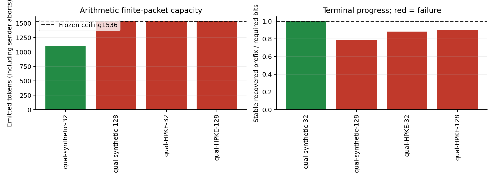
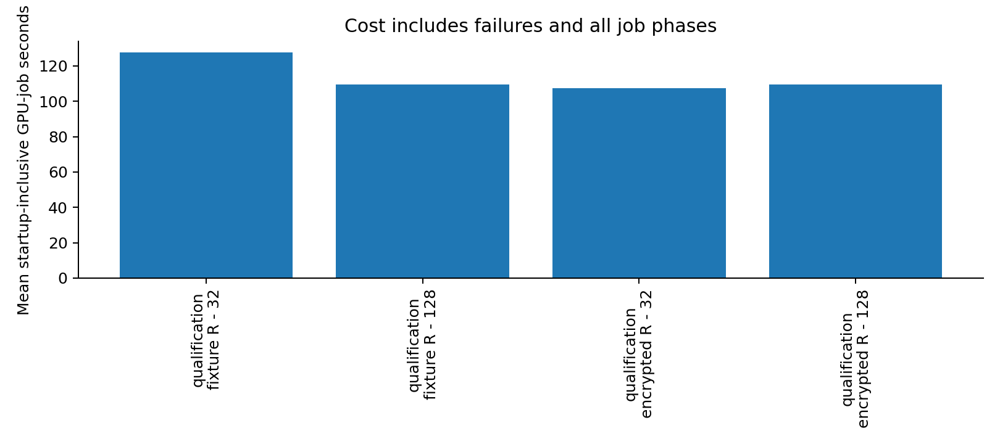

# Stage 7: public arithmetic comparator — qualification stopped on capacity

**The arithmetic adapter passed independent focused CPU checks and one actual-UTF-8 synthetic-envelope inverse, but neither fresh HPKE qualification packet completed within the frozen 1,536-token ceiling. The qualification gate failed. GPU work stopped after four attempts; the main F/R comparison, controls and fresh-process replays were not executed.** No parameters were changed to rescue these failures.

This is a concrete bounded qualification result, not a completed comparative recognition study. It leaves the arithmetic comparator **BLOCKED for the planned main study**. The engineering implementation and failure evidence are ready for external review; the evidence does not yet support the proposed regular-paper comparison.

## Revisions and retained evidence

Repository: [mantzaris/CalgacusPublicEncryption](https://github.com/mantzaris/CalgacusPublicEncryption), directly on `main`. Actual starting revision was **c2b4f91f0cc6842c37133ce31576ae2fa455b2a6**, clean. All four GPU attempts used **0fc812f7a71e80aa8d2c831d26c1c99202171cf2**, committed with the implementation, public profiles, fixed allocation, test keys, independent checks and analysis specification before inference. No inference code changed during or after those attempts. Host analysis and this report were added later.

The [study specification](docs/stage7_study_spec.md), [source audit](docs/stage7_comparator_audit.md), [allocation](artifacts/stage7/allocation.json), [summary](artifacts/stage7/summary.json), [attempt records](artifacts/stage7/cases.jsonl), [capacity records](artifacts/stage7/capacity.json) and [evidence manifest](manifests/stage7_evidence.json) link every result to configuration, exact source revision, commands, actual wire bytes or internal partial output, worker identity and ledger charge. Published keys are clearly labelled TEST_ONLY synthetic fixtures. No operational credentials, model weights or copied unlicensed implementation are committed.

All historical Stage 6 experimental files remain unchanged, and every historical ledger byte is preserved. The shared ledger gains eight events—one reservation and settlement per attempt—and its checkpoint advances. Earlier data are not pooled. Qualifications remain development-only; unused prospective slots are not relabelled successes or held-out observations.

## Comparator and finite packet contract

The primary reference is Ziegler, Deng and Rush, [*Neural Linguistic Steganography*](https://aclanthology.org/D19-1115/), EMNLP-IJCNLP 2019, §§2–4, especially §3's arithmetic reversal and finite-message stopping. The actual official `arithmetic.py`, helpers, README and requirements were inspected at **14e982564aeaf9a33f7b4de440deda2184d17f12**. That tree has no license file. No upstream code is copied: this is an independently written **adapted public arithmetic comparator**, with source hashes and dependencies recorded in [comparator_sources.json](artifacts/stage7/comparator_sources.json).

F inherits existing length-inferred rank16 mapping. R directly inherits the same existing canonical candidate-selection function: descending native logits, ascending token-ID ties, first 16 eligible tokens among the top 128; special/control/empty tokens excluded; complete proposed carrier prefix must be strict UTF-8 and retokenize exactly. Historical codecs and profiles are preserved. New registered [Stage 7 profiles](configs/stage7/) bind four new contexts and public size classes.

Both methods publicly agree a 32- or128-byte payload class, hence a 100- or196-byte envelope. This is a pre-agreed channel setting with **no on-wire metadata**, bound through the complete profile in unchanged HPKE information/AAD. It is not self-delimiting or length hiding. F remains 200/392 actual tokens with its 512-token bound; R's single frozen ceiling is 1536 within the unchanged 2048-token context window. F was implemented and checked on a toy model under these new profiles, but was not GPU-run in Stage 7.

R uses 32-bit inclusive intervals, E1/E2/E3 renormalization and MSB-first packet bits. Conditional probabilities over the same 16 candidates become positive integer frequencies summing 65536 by the documented largest-remainder rule. No candidate is silently dropped for zero probability width. A public midpoint suffix—one bit followed by zeros—extends the finite packet. Emission stops at the first token yielding the required stable bit count. The receiver bounds actual UTF-8/token count, reconstructs public tables from the received text, rejects invalid choices, incomplete final intervals and appended tokens, and verifies the deterministic suffix through pure-integer canonical replay. It receives no encoder IDs/ranks, expected payload hash/length, caches or terminal-state trace. Public size class is the agreed configuration, not a hidden evaluator hint.

An initial CPU-only zero-extension draft exposed dyadic-boundary nontermination in the independent checks. Its failed output is preserved in [focused_core_checks.txt](artifacts/stage7/focused_core_checks.txt); midpoint handling corrected it **before any GPU run or profile freeze**. No live failed attempt was repaired or retried.

HPKE remains pyhpke 0.6.5, Base mode, DHKEM(X25519,HKDF-SHA256), HKDF-SHA256 and ChaCha20-Poly1305. The record remains random 16-byte message identifier, u32be payload length and payload, without padding. Fresh library/OS encryption randomness was used for both HPKE qualification attempts. No secret prompt or new cryptographic primitive was introduced. HPKE Base mode does not authenticate a sender.

## Qualification outcomes

| Case / context | Packet | Stable bits / required | Emitted tokens | Actual outcome | Charged seconds | Evaluated tokens |
|---|---|---:|---:|---|---:|---:|
| Synthetic / maple leaf |100 raw bytes|800/800|1100|Exact envelope recovery from 5278-byte UTF-8|127.466|2224|
| Synthetic / cups on shelf |196 raw bytes|1229/1568|1536|Capacity abort; no message delivered|109.326|1548|
| HPKE / platform clock |32-byte payload,100-byte envelope|705/800|1536|Capacity abort; no message delivered|107.250|1546|
| HPKE / rain beside clay pot |128-byte payload,196-byte envelope|1408/1568|1536|Capacity abort; no message delivered|109.345|1547|

The successful synthetic fixture encoded for 56.281 seconds and reconstructed for 56.006 seconds after a fresh cache reset. All 1100 receiver candidate-order hashes match their encoder counterparts. It carried 0.7273 **synthetic envelope bits** per token; this is not measured useful encrypted-payload rate. Its receiver began with the saved `carrier.txt`. It ran inside the same worker process, so it does **not** satisfy the independent fresh-process HPKE gate.

The capacity failures stop at the declared ceiling before serialization/delivery or HPKE authentication. Their full internal partial emissions and interval states remain in their attempt directories. They are not ciphertext-authentication failures, incorrect inverse demonstrations, control messages or observable wire traffic. Among the one completed wire message there was no UTF-8 or retokenization drift. There were no candidate-set exhaustion, numerical, lease, deadline, provenance or worker-exit failures. The capacity failure is specifically insufficient packet progress within 1536 tokens, despite16 admissible candidates at every step.



| Stratum | Planned | Attempted | Recovery / disposition |
|---|---:|---:|---|
| Synthetic qualification |2|2|1/2 exact raw-envelope recovery|
| HPKE qualification32 bytes |1|1|0/1 exact authenticated recovery; capacity abort|
| HPKE qualification128 bytes |1|1|0/1 exact authenticated recovery; capacity abort|
| Qualification fresh receivers |2|0|Both predetermined sources unavailable; no substitution|
| Main F32 / F128 |8 /8|0 /0|Not executed; recovery rate undefined|
| Main R32 / R128 |8 /8|0 /0|Not executed; recovery rate undefined|
| Main A / B controls |32 /32|0 /0|Not executed|
| Main fresh receivers |8|0|Qualification gate blocked release|

There were no replacement cases, extra seeds or investigations. The remaining 106 planned slots and 18 unallocated case slots were left unused. The gate was not a resource-limit failure: unused authorized budget is a ceiling, not a reason to search for favorable outcomes.

## Recognition and scientific interpretation

**There are no Stage 7 control frequencies, ROC/AUC results or F-versus-R recognition effects to report.** The frozen observer implementation accepts only actual received bytes and agreed public inputs. It computes complete-message canonical-token surprisal, ranks, membership, lengths, public extraction/termination and the necessary canonical X25519 encapsulation representation check in one scoring pass. It never authenticates tags. No F 64-token body exclusion is applied to R; body scores are deliberately unavailable for both methods.

The 32 main encrypted settings, 64 length-conditioned controls and 8 predetermined independent receivers were frozen but not released. Their definitions remain reviewable: ordinary full-vocabulary temperature-one controls and probability-weighted controls over the exact shared16 candidates, with explicit serialization/EOS handling and failed-source length fallbacks. No control was silently omitted from an executed comparison; the entire main comparison was stopped at qualification.

Public termination and packet representation are plausible residual recognition signals, not measured findings here. The canonical X25519 predicate is a necessary honest-sender output convention from RFC7748 §5/RFC9180 §§4.1/7.1.1, not key validity or HPKE authentication. Neither full envelopes nor finite arithmetic output are assumed uniformly random. Restricted support does not match the unrestricted language model or human traffic, and canonical-token likelihood is not automatically UTF-8-string probability.

The concrete observation beyond simply replacing one mapping is operational: **this fixed comparator could transport one 100-byte synthetic packet yet could not complete either of the two real encrypted packets at the same public ceiling**. Progress varied from 705 to 1408 stable bits over 1536 emitted tokens across the three aborted contexts/packets. Context, input bits and packet size differ, so this is not a causal attribution to HPKE structure or a population estimate. Low-entropy conditional generation and finite-packet costs are expected principles; these few measured failures do not establish a distinctive scientific contribution.

## Verification, resource costs and provenance

[Fifteen focused tests](artifacts/stage7/focused_checks.txt) passed in 1.57 seconds before the GPU freeze. They include independently computed exact-rational uniform/skew/changing-table examples, explicit nibble and interval-boundary outputs, all-zero/all-one inputs, a packet crossing the precision boundary, maximum-sized bytes, incomplete/trailing intervals, malformed UTF-8/choices, public class bounds, exact HPKE recovery on toy transports, public-only observer arguments and accounting restart/lock/rollback behavior. Earlier broad cryptographic known-answer tests were reused at their historical revisions; no new full CPU suite or CPU model inference ran. The small [allocation check](artifacts/stage7/allocation_check.txt) verified full reservations, all-pass token bounds, context fit and ceilings.

Rediscovery and all four workers verified **NVIDIA RTX 5000 Ada Generation**,32760 MiB, driver590.48.01, UUID `GPU-10d1f16f-9e79-08bb-b2ba-3353c04422cf`. Each worker has a distinct PID matched to GPU samples and **33/33 layers offloaded**, valid lease, clean exit, phase-meter sum and source provenance. Peak sampled process memory was5006 MiB; it is a sampled maximum. The other attached Quadro T2000 was unused.

Model remains Meta-Llama-3-8B-Instruct Q4_K_M, model SHA256 `86c8ea6c8b755687d0b723176fcd0b2411ef80533d23e2a5030f845d13ab2db7`, tokenizer SHA256 `5c8950bef385be95db5feda8c8afadba6a5c0b903e6ceaa39efe6cfe3d84f3f3`. Environment: llama-cpp-python 0.3.23, NumPy 2.2.6, CUDA runtime 12.4.127, cuBLAS 12.4.5.8, Python 3.10.13; exact OS/native/CUDA hashes are in [environment.json](artifacts/stage7/environment.json). Float32 logits, f16 KV,2048 context, batch/ubatch1 and complete cache clearing are unchanged. No backend rebuild, model download, cloud or paid API was used.

| Accounting | GPU-job seconds | Evaluated tokens | Attempts |
|---|---:|---:|---:|
| Historical anchor |7541.884885363|124994|214|
| Stage 7 measured |**453.387151417**|**6865**|**4**|
| Lifetime |**7995.272036780**|**131859**|**218**|
| Unused Stage 7 allowance |13946.612848583|293135|124|

Charges include model loading/startup, all prompt prefill, 5708 emitted tokens, 1100 reconstructed tokens, and shutdown. Phase totals are 5753 encoding and 1112 public fixture inverse evaluated tokens. Loading/verification took 14.34–14.66 seconds per job. All 6808 candidate steps found 16 eligible candidates; they examined 109607 candidates in total, maximum 28 in one step. No warmup or observer calls occurred outside accounting. Aborted sender work is fully charged, while abandoned reservations would remain conservatively charged under the existing governor.



[Host reconciliation](artifacts/stage7/analysis_output.txt) checks reservations/settlements, immutable IDs, source/profile hashes, saved carrier and payload/envelope hashes, phase totals, PID samples, leases, full offload, the complete historical ledger prefix and unchanged historical experiment files. No unresolved reservation remains.

## Answers and next decision

1. **Independently validated?** Yes for the focused integer/reference and toy boundary contracts; one real-model synthetic inverse passed. End-to-end live HPKE and fresh-process qualification remain unestablished.
2. **Recovered or failed?** One100-byte synthetic packet recovered; one 196-byte synthetic and both 32/128-byte HPKE attempts exhausted1536 tokens. No successful encrypted message was delivered.
3. **Statistical recognition relative to F?** Not measured; the main comparison never started.
4. **Public envelope/termination recognition?** Implemented public tests, no measured complete-HPKE/control evidence in Stage 7.
5. **Rate/capacity/cost?**1100 tokens and 127.47 startup-inclusive seconds for the successful two-pass synthetic case; three retained ceiling aborts at 107.25–109.35 seconds. Useful authenticated payload throughput was zero over the two HPKE attempts; successful-message rate metrics are unavailable.
6. **Beyond an expected probability-matching consequence?** A reproducible, quantitatively specific adverse capacity result under the actual-text contract. No distinct general scientific finding is established by four qualifications.
7. **Submission readiness?** Not yet. The precise missing prerequisite is a real encrypted packet plus independent receiver that qualifies the unchanged bounded arithmetic interface; the main missing result is then the controlled full-message F/R recognition comparison under explicit control/abort models.

Provisional contribution statement: *An empirical account of the interaction between finite encrypted packets, canonical text transport and public recognition under a common language-model support.* This remains a research direction; [stage7_claims.md](docs/stage7_claims.md) links its established, measured and unresolved parts to evidence.

**Recommended next step:** independently review the retained finite-packet progress traces and capacity contract before authorizing any further GPU cases. This host-only review can determine whether a narrowly justified qualification revision is warranted; it should not assume that more samples, a larger token ceiling or favorable context selection resolves the scientific question. No larger study is automatically commissioned.

## Reproduction and stopped-run behavior

```bash
.venv/bin/python -m pytest -q tests/test_stage7.py
.venv/bin/python scripts/run_stage7.py --allocation-check
.venv/bin/python artifacts/stage7/analyze.py
MPLCONFIGDIR=/tmp/stage7-mpl ../llm-rankcloak/.venv/bin/python artifacts/stage7/plot.py
```

The executed GPU command was `.venv/bin/python scripts/run_stage7.py --phase qualification`, under the recorded source revision. Its stopped status intentionally prevents reruns. `--phase main` additionally requires a committed qualification release, which does not exist because the gate failed. Reproduction of inference needs separate explicit allocation/attempt planning; deleting statuses or resetting the ledger is not a reproduction procedure. No Stage 8, additional GPU execution or paper submission is authorized by this report.
