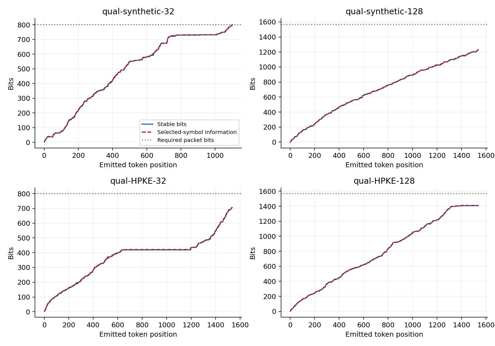
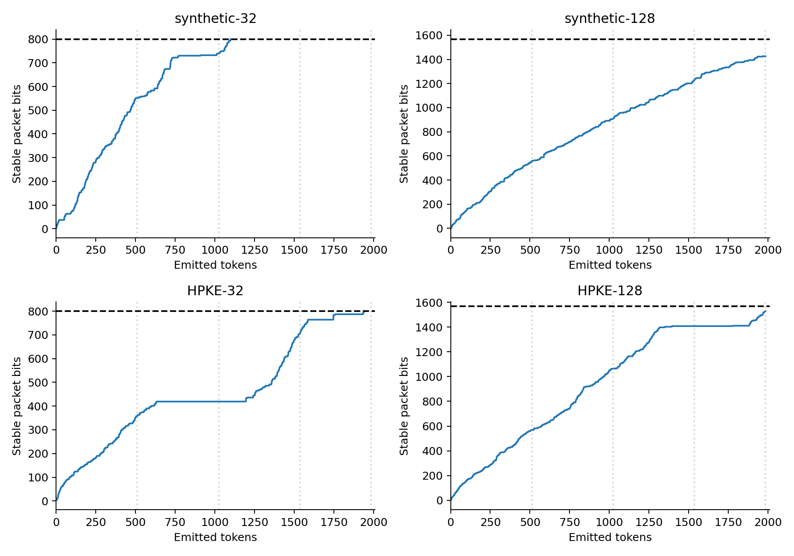
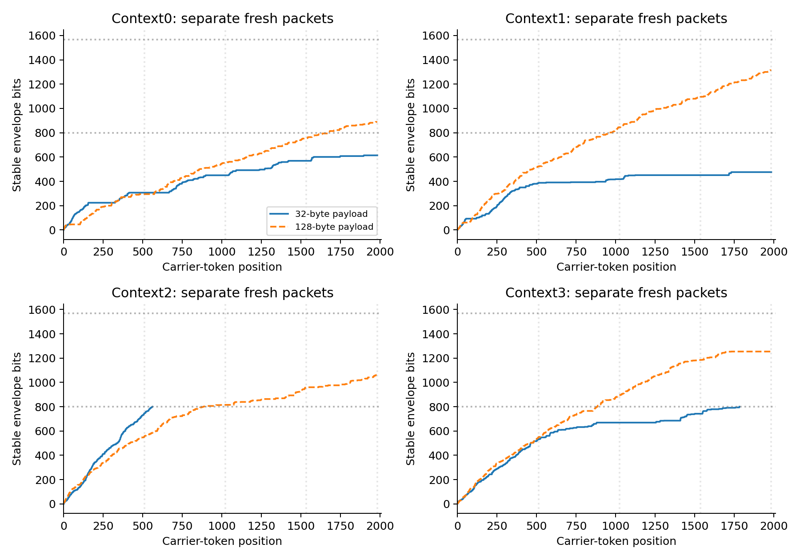
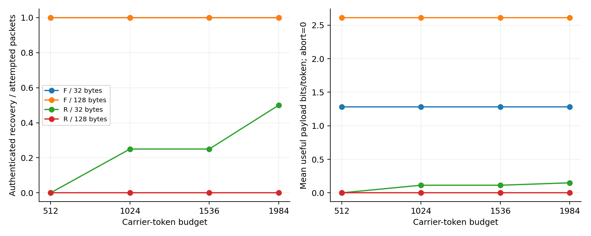
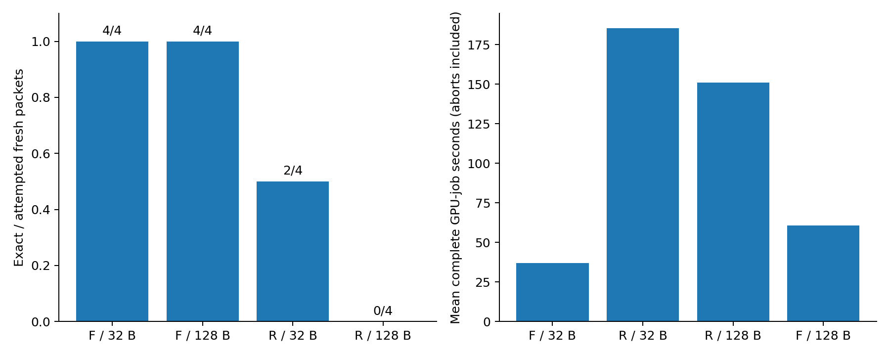
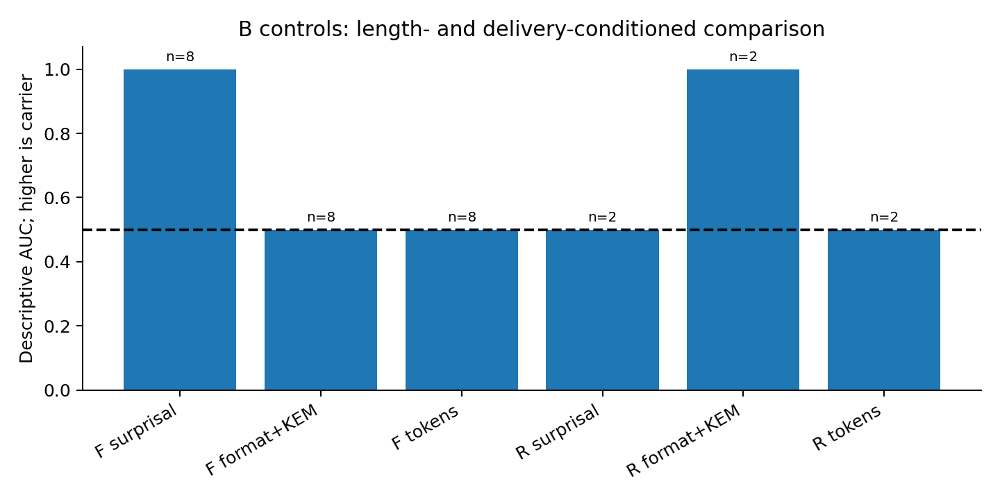

# Stage 8: arithmetic capacity extension and bounded comparison

**Completed: a useful but narrow capacity finding, with a delivery-conditioned comparison. Qualification passed; the frozen main allocation finished. No arithmetic defect was found. The larger ceiling enabled some 32-byte packets but did not qualify reliable 128-byte transport.**

The independent historical diagnosis found consistent arithmetic, with capacity lost to low-information trajectories rather than an incorrect inverse. The one authorized ceiling extension from 1,536 to 1,984 tokens preserved all four historical prefixes. It completed the old 32-byte HPKE packet at 1,942 tokens, including independent actual-UTF-8 reception and authentication under its original binding. Both 196-byte historical packets still exhausted the new ceiling.

The symmetrically reduced fresh comparison completed 16 encrypted attempts: F recovered 4/4 at each payload size; R recovered 2/4 at 32 bytes and 0/4 at 128 bytes. The six R failures were capacity exhaustion, with no delivered message. This is a useful but narrow capacity finding with a limited delivery-conditioned recognition comparison. It does not establish a generally reliable 128-byte arithmetic transport or publication readiness.

## Starting state, implementation and scope

Repository: [mantzaris/CalgacusPublicEncryption](https://github.com/mantzaris/CalgacusPublicEncryption), directly on `main`. Actual starting revision was `e55680169ef7c0e7110bfaddc0b5392e28419bb8`, with a clean working tree. Stage 7 GPU source `0fc812f7a71e80aa8d2c831d26c1c99202171cf2` and its stopped qualification remain unchanged.

Stage 8 diagnostic source was `a97c75911b0ae5105bbc1fbb869a37fe9166306a`. Fresh main jobs used `78617213825f1163b3692f698e1063ba32a7de73`. The latter commit adds retained diagnostic evidence, host analysis/plots and the committed symmetric main release; it changes no profile or inference implementation after qualification. Later host analysis and this report are not attributed to either GPU revision as live-tested code.

The arithmetic core, frequency construction, precision, midpoint suffix, first-complete-packet termination, candidate selection, model, tokenizer, numerical settings, temperature, four contexts and public size classes remain unchanged. Only R's carrier ceiling changes to 1,984 under new exact registered Stage 8 profiles. F keeps its 200/392-token mapping and 512-token bound under new Stage 8 identities. Model context remains 2,048. Actual context lengths including BOS are 12, 12, 10, 11; the largest context plus carrier plus one conservative backend position is 1,997, leaving 51 positions. Every worker verifies the exact context token IDs and window fit.

Fresh HPKE envelopes bind their intended complete Stage 8 public profile. Historical diagnostics re-embed exact old envelope bytes under the extended transport and open them only under the original Stage 7 authenticated binding. Raw-envelope recovery, original-binding authentication and fresh Stage 8-bound recovery are separate outcomes. No receiver receives expected hashes, envelope bytes, encoder IDs/ranks or caches. Fresh-process receivers begin with saved UTF-8, public configuration and the test private key; the evaluator compares hashes outside them.

The existing independently written adapted public arithmetic comparator is retained. Its primary reference, official-source revision and no-upstream-license limitation remain documented in [the Stage 7 audit](docs/stage7_comparator_audit.md). No unlicensed upstream code or tokenizer-specific repair is added. This is not unmodified Calgacus, a new encryption primitive or a claimed novel arithmetic algorithm. Earlier Calgacus and rank16 profiles and experimental records remain identifiable and unchanged.

## Independent historical diagnosis

[The diagnosis](docs/stage8_capacity_diagnosis.md) and [independent calculation](artifacts/stage8/diagnose.py) reconstruct all 5,708 historical encoder steps from saved symbols and integer frequency tables, without importing the production coder or invoking a model. Exact rational boundary products and a separate half-open interval convention agree with every recorded endpoint, stable bit, pending bit and packet prefix. Hand-specified uniform and half-mass examples provide independent expected outputs.

| Historical packet | Required bits | Stable bits at old stop | Pending | Selected-symbol information |
|---|---:|---:|---:|---:|
| Synthetic100 bytes |800|800|2|803.337510|
| Synthetic196 bytes |1568|1229|0|1229.892850|
| HPKE32-byte payload |800|705|0|705.476107|
| HPKE128-byte payload |1568|1408|2|1410.797568|

Accumulated effective interval information equals stable bits + pending bits + `32-log2(residual interval width)` at every step. Cumulative integer-interval rounding changes selected-frequency information by less than 0.000025 bits in these cases. That is an interval-partition check, not a claim that rounding model probabilities never matters. Historical unrounded logits were unavailable; Stage 8 public scoring records rounded/unrounded conditional-table differences separately.

The 32-byte HPKE trajectory has a 256-token block (769–1024) releasing zero stable bits while accumulating only 0.115071 selected-information bits; mean table entropy is 0.005118 bits/token. Its longest no-release run spans 564 tokens. Small pending debt cannot explain the missing 95 bits at the old ceiling. The other failures likewise retain substantial packet deficits. These cases differ in context and input bytes; the evidence does not attribute their differences to HPKE structure.



## Repeated-packet qualification

All four extended encodings matched the full old prefix: token IDs, ordered-candidate hashes, arithmetic frequencies and interval/stable/pending state. No arithmetic repair or parameter retry was needed.

| Repeated historical packet | New stopping tokens | Stable / required bits | Raw-envelope result | Original-binding HPKE result |
|---|---:|---:|---|---|
| Synthetic100 bytes |1100|800/800|Exact; independent receiver also exact|Not applicable|
| Synthetic196 bytes |1984|1426/1568|Capacity abort|Not applicable|
| HPKE32-byte payload |1942|800/800|Exact; independent receiver also exact|Authenticated in both jobs|
| HPKE128-byte payload |1984|1529/1568|Capacity abort|Not opened|

Six diagnostic jobs used 934.306489326 seconds and 13,183 evaluated tokens. Two unavailable large-packet receiver slots remained unused. These are historical-packet diagnostics and replays, not independent fresh transmissions. The old 1,536-token results are not changed by later completion. No partial bit progress is counted as authenticated payload recovery.



## Frozen fresh allocation and capacity

Before fresh inference, [main_release.json](artifacts/stage8/main_release.json) reduced every context/size/method to one repetition. Two repetitions forecast 15,973.894 seconds before diagnostics, above the Stage 8 limit. One repetition forecast 8,397.847 seconds, including startup and margins and assuming full-ceiling successful R passes. Its full reservations total 9,730 seconds, 110,864 tokens and 40 cases; these also fit with actual diagnostic use. This decision did not rely on future failures saving time.

The released matrix has 16 fresh encryptions, 16 probability-weighted admissible controls and eight predetermined receiver slots. Eight independent test recipient keys remain balanced by context and size. F/R pair the synthetic binary payload, key and public context, with independent fresh HPKE randomness and message identifiers. The four Stage 7 contexts are development-informed, not unseen final-test contexts. Historical and diagnostic results are never pooled with this matrix.

Controls use temperature-one **unrounded model probabilities** within the shared 16 admissible candidates. R uses the unchanged 65,536-integer-frequency approximation. Each control matches its associated delivered carrier's token count, or uses the predeclared failed-source fallback (1,984 for R, 200/392 for F). No ordinary-control matrix, resampling or failed-case replacement is added.

Fresh recovery checkpoints are nested observations of one trajectory. The 32-byte R recoveries stop at 563 and 1,783 tokens. Thus recovery is 0/4 at 512, 1/4 at1,024, 1/4 at1,536 and2/4 at1,984. R128 remains 0/4 at all checkpoints. F completes 4/4 at each size before512 tokens. These are computational stopping checkpoints within the fixed Stage 8 profile, not ciphertexts rebound to hypothetical older profiles.

Successful-message useful rates and attempt-level rates are separated. The latter assigns zero to an aborted/unrecovered attempt; it does not pretend internal partial emissions were transmitted. Recovered bytes per charged second also includes failed jobs, startup and all actual passes.




## Measured recovery, costs and fresh receivers

| Method | Payload bytes | Exact / attempted | Capacity failures | Successful tokens | Success bits/token | Attempt mean bits/token | Mean job seconds |
|---|---|---|---|---|---|---|---|
| F | 32 | 4/4 | 0 | 200–200 | 1.2800 | 1.2800 | 37.0737 |
| F | 128 | 4/4 | 0 | 392–392 | 2.6122 | 2.6122 | 60.6844 |
| R | 32 | 2/4 | 2 | 563–1783 | 0.2991 | 0.1496 | 185.4250 |
| R | 128 | 0/4 | 4 | NA | NA | 0.0000 | 151.0288 |

Rates in the table are per-message means, not pooled bit/token ratios. R's two 32-byte successes used 563 and1,783 tokens: 0.454707 and 0.143578 useful payload bits/token, respectively, versus F's 1.28. Their envelopes carry 800 total bits; useful payload is 256 bits. The pooled delivered-message R rate is 0.218244, while the attempt-level mean including two aborts is 0.149571. R32 recovers 0.086288 payload bytes per charged second across all four attempts; R128 recovers none. These measures answer different questions and are not interchangeable.

The two successful R jobs took 86.408 and 356.717 seconds including startup, encode, receive and public scoring. Their encode/receiver/scoring times were 23.47/23.56/24.21 and 112.55/113.01/115.44 seconds. F32's corresponding phase means were 7.06/7.03/7.31 seconds; F128's were 14.97/14.96/15.45. R128's mean encoding time before abort was 135.67 seconds; it had no reception or scoring pass. Per-case and phase-conditioned costs remain in [costs.csv](artifacts/stage8/costs.csv).

| Phase | Group | Recovery meaning | 512 | 1024 | 1536 | 1984 |
|---|---|---|---|---|---|---|
| diagnostic | diagnostic-qual-synthetic-32 | raw synthetic envelope | 0/1 | 0/1 | 1/1 | 1/1 |
| diagnostic | diagnostic-qual-HPKE-32 | authenticated payload | 0/1 | 0/1 | 0/1 | 1/1 |
| diagnostic | diagnostic-qual-synthetic-128 | raw synthetic envelope | 0/1 | 0/1 | 0/1 | 0/1 |
| diagnostic | diagnostic-qual-HPKE-128 | authenticated payload | 0/1 | 0/1 | 0/1 | 0/1 |
| main_fixed | F/32 | authenticated payload | 4/4 | 4/4 | 4/4 | 4/4 |
| main_fixed | F/128 | authenticated payload | 4/4 | 4/4 | 4/4 | 4/4 |
| main_fixed | R/32 | authenticated payload | 0/4 | 1/4 | 1/4 | 2/4 |
| main_fixed | R/128 | authenticated payload | 0/4 | 0/4 | 0/4 | 0/4 |

All 16 B controls generated their exact assigned token count and canonical UTF-8. Five main fresh-process replays authenticated and recovered exactly: F32 and F128 in contexts 0 and 2, plus R32 in context 2. Their token IDs, candidate orders and, for R, arithmetic states match the source encoder when compared **afterward** by the evaluator. R32/context 0 and both predetermined R128 sources were unavailable; no substitute was selected. The successful R32/context 3 carrier was not selected by the fixed replay rule. Replays are not additional independent transmissions.

There were eight retained capacity failures in Stage 8: two diagnostic encodings and six fresh R encodings. All 74,123 candidate-selection steps found 16 eligible candidates; maximum examined was 28 of the allowed 128, and 1,201,149 candidates were examined in total. These failures concern insufficient packet information, not candidate-set exhaustion. There were no malformed delivered texts, retokenization drift, wrong inverses, authentication failures, numerical divergence, timeout, lease or accounting failures.



## Public recognition and limitations

The observer begins with actual UTF-8 and public configuration, never private keys, payload hashes, encoder traces or authentication outcomes. One complete scoring pass supplies canonical-token surprisal, ranks, candidate membership, packet extraction/termination, the necessary canonical X25519 representation predicate and lengths. Format acceptance is not HPKE authentication. Canonical-token likelihood is not assumed to equal UTF-8-string probability. No fixed 64-token F body boundary is used for arithmetic output; body-region scores are unavailable for both methods.

The primary matched comparison conditions on delivered, scorable messages and matched B controls, without an authentication filter. Controls associated with aborted sources remain in the complete records and outcome counts. An internal abort is not automatically a visible network event. Joint-support R-minus-F comparisons further restrict both methods and their controls to the same delivered context/size/key groups. Here R has only two delivered fresh messages, both 32-byte payloads in contexts 2 and 3. That sharply limits comparative inference.

Score orientations are frozen higher-is-carrier; directions are not flipped after observing results. Token-length matching is explicit. Context/key-group bootstrap resampling retains paired methods/controls and nested checkpoints, with 2,000 draws and fixed seed. Four development-informed contexts, two R deliveries, undefined empty-support draws, and potentially degenerate all-success/separation intervals preclude population-level reliability or concealment claims.

### Measured public scores

| Public score; higher is carrier | F: 8 matched pairs | R: 2 matched pairs | R context/key bootstrap interval |
|---|---:|---:|---:|
| Complete-message canonical-token surprisal AUC |1.000|0.500|[0,1]|
| Mean log2 rank AUC |1.000|0.500|[0,1]|
| Admissible-set surprisal AUC |1.000|0.500|[0,1]|
| Public format/stopping acceptance AUC |0.500|1.000|[1,1]|
| Format plus canonical KEM representation AUC |0.500|1.000|[1,1]|
| Token-length AUC |0.500|0.500|[0.5,0.5]|
| UTF-8 byte-length AUC |0.453125|0.500|[0,1]|

Mean canonical-token surprisal is 5.8166 bits/token for F carriers versus 1.0993 for their controls, and 0.9821 for delivered R carriers versus 0.7083 for their matched controls. Membership is complete for all carriers and B controls, as expected from their common admissible support. Token-count AUC is mechanically 0.5 under exact length matching; these are not unconditional traffic results. Full distributions, size-stratified results and fixed score orientations are in [recognition.csv](artifacts/stage8/recognition.csv), [size_recognition.csv](artifacts/stage8/size_recognition.csv) and [tables.md](artifacts/stage8/tables.md).

All eight F carriers **and all eight F controls** pass both format and necessary KEM-representation checks. Public extraction is therefore not by itself a discriminator under this control distribution. Both delivered R carriers pass format, while all eight R controls fail it: six incomplete final intervals and two trailing-token rejections. Among the two matched R controls, one is incomplete and one has trailing tokens. This identifies completion/stopping consistency as the observed structural signal; it does **not** isolate midpoint-suffix recognition. The KEM predicate adds no observed discrimination to R's already-separating format test, and public tags are never authenticated.

On the joint delivered support (contexts 2/3, 32-byte class), F/R surprisal AUCs remain 1.0/0.5. R-minus-F is −0.5 with descriptive cluster interval [−1,0]. Only 1,677 of 2,000 mixed context/key-group bootstrap draws contain available R pairs; empty-support draws are undefined. Within the two R contexts, the single-pair surprisal ordering is opposite (AUC 1 in context 2, 0 in context 3). The aggregate 0.5 is consequently weak evidence of matching, not evidence of concealment. Degenerate F separation and R format intervals reflect the retained sample, not perfect population performance.

Scored conditional tables differ slightly between R's integer probabilities and B's unrounded probabilities: the maximum observed total variation per step is 0.000238725. Mean per-message TV is 0.000198056 for the two delivered R messages and 0.000214428 over all eight R controls. [rounding_summary.json](artifacts/stage8/rounding_summary.json) retains the other strata and entropies. Small local TV does not establish identical full-message distributions or exclude path-dependent effects.



## Accounting, evidence and reproduction

Stage 8 is a subset of unused Stage 7 authorization, not a budget increase. It is anchored to the exact historical ledger prefix at 7,995.272036780 seconds, 131,859 tokens and 218 cases. The Stage 8 caps are 10,800 seconds, 230,000 evaluated tokens and 88 attempts; lifetime caps remain 21,941.884885363 seconds, 424,994 tokens and 342 cases. The shared execution lock, persistent full reservations, one-shot worker leases, startup-inclusive timing, token meter and deadlines remain active. Interrupted jobs would retain conservative reservations. No retry or investigation allocation was used.

GPU rediscovery selected NVIDIA RTX 5000 Ada Generation, 32,760 MiB, driver 590.48.01, UUID `GPU-10d1f16f-9e79-08bb-b2ba-3353c04422cf`. Model remains Meta-Llama-3-8B-Instruct Q4_K_M, model SHA256 `86c8ea6c8b755687d0b723176fcd0b2411ef80533d23e2a5030f845d13ab2db7`, tokenizer SHA256 `5c8950bef385be95db5feda8c8afadba6a5c0b903e6ceaa39efe6cfe3d84f3f3`. Float 32 logits, f16 KV, batch/ubatch 1, full cache resets and 33/33-layer GPU offload are unchanged. The other attached Quadro T2000 is unused for model inference. Native/CUDA hashes, OS, Python, llama-cpp-python 0.3.23 and NumPy 2.2.6 are recorded in [environment.json](artifacts/stage8/environment.json). HPKE remains pyhpke 0.6.5 with unchanged established suite and authenticated inner record.

Five focused Stage 8 tests passed before diagnostic freeze: exact profile differences, old/new HPKE binding behavior, receiver/window boundaries, subset accounting and prefix-divergence detection. Historical cryptographic and Stage 7 arithmetic validation retain their original tested revisions; no broad CPU suite or CPU model inference ran. Host-only reconciliation independently checks interval/packet prefixes, retained source and profile hashes, worker PID/GPU samples, phase counts, leases, clean exits, carrier/envelope/payload hashes and the complete historical ledger prefix.

### Final accounting and verification

| Scope | Conservative GPU-job seconds | Evaluated tokens | Attempts |
|---|---:|---:|---:|
| Historical anchor |7,995.272036780|131,859|218|
| Stage 8 diagnostics |934.306489326|13,183|6|
| Stage 8 fresh matrix, controls and replays |4,222.568992817|61,845|37|
| **Stage 8 total** |**5,156.875482143**|**75,028**|**43**|
| **Lifetime total** |**13,152.147518923**|**206,887**|**261**|
| Remaining Stage 8 suballocation |5,643.124517857|154,972|45|
| Remaining parent authorization |8,789.737366440|218,107|81|

Remaining suballocation and parent figures are overlapping constraints, **not allowances to add together**. No further execution is launched. Forty-three unique worker PIDs match the selected GPU, all logs show 33/33-layer offload, all leases/source/profile/phase/window checks pass, all workers exit cleanly and all reservations are settled. Sampled peak process memory is 5,006 MiB; this is not an unsampled absolute peak. Load/verification time ranges 14.25–15.56 seconds per job.

Phase token totals are 23,853 encoding, 3,064 diagnostic inverse, 4,825 main reception, 16,798 control generation, 21,623 public scoring and 4,865 fresh receivers. They sum exactly to 75,028. All startup, failed encodings, prefill, host tokenization work inside jobs and shutdown are included in conservative elapsed charges. No warmups or inference occurred outside the ledger.

The complete starting ledger prefix is byte-for-byte preserved, and all prior experiment files, profiles and stopped Stage 7 statuses are unchanged. Only the shared profile registry, ledger implementation and the appended ledger/checkpoint differ among previously tracked files. The frozen 80-slot inventory remains intact: 32 slots were removed symmetrically before main release, five predetermined receivers were unavailable, and the eight unallocated investigation slots remain unused. None is a discarded attempted failure. Main status's generic `qualification_passed` field is unused; the actual release gate is the passed diagnostic status plus committed main_release.json.

[analysis_output.txt](artifacts/stage8/analysis_output.txt) records successful reconciliation, including independent arithmetic/packet-prefix reconstruction for every Stage 8 R encoding and encoder/independent-receiver trace agreement. The five focused tests are linked in [focused_checks.txt](artifacts/stage8/focused_checks.txt); no broad suite was rerun. [analysis_notes.md](artifacts/stage8/analysis_notes.md) records the host-only correction that aligned the recovery bootstrap implementation with the already-frozen size-stratified rule.

The [evidence manifest](manifests/stage8_evidence.json) connects immutable attempt IDs, source revisions, public profiles, input/command/result files, traces, actual carriers or internal partial output and ledger charges. Published private keys are labelled TEST_ONLY synthetic fixtures. No operational credentials or model weights are committed.

Executed and host reproduction commands:

```bash
.venv/bin/python artifacts/stage8/diagnose.py
.venv/bin/python -m pytest -q tests/test_stage8.py
.venv/bin/python scripts/run_stage8.py --allocation-check
.venv/bin/python scripts/run_stage8.py --phase diagnostic
.venv/bin/python artifacts/stage8/release_main.py
.venv/bin/python scripts/run_stage8.py --phase main
.venv/bin/python artifacts/stage8/analyze.py
.venv/bin/python artifacts/stage8/tables.py
MPLCONFIGDIR=/tmp/stage8-mpl ../llm-rankcloak/.venv/bin/python artifacts/stage8/plot.py
```

GPU commands are historical execution records, not permission to restart completed phases. Existing statuses and one-shot allocation records prevent reruns. Do not delete statuses, reset the ledger or reuse old attempt IDs to reproduce inference. The analysis/table/plot commands consume saved records only.

## Paper assessment

The strongest candidate contribution remains an empirical account of **finite encrypted-packet capacity, canonical actual-text recovery and public recognition under a shared language-model support**. Arithmetic coding, HPKE, full-prefix tokenization checks and the elementary effect of allowing more carrier tokens are established ingredients or expected engineering consequences.

The specific contribution of this stage is narrower: an independent accounting of how low-information trajectories caused the retained failures, exact preservation of those trajectories under one safe ceiling extension, and fresh attempt-level evidence that the extension supports some 32-byte packets while all four 128-byte attempts still fail. Delivered-message recognition must be interpreted alongside those aborts, rather than as an unconditional concealment result. Public packet structure and cryptographic plaintext confidentiality can coexist. HPKE Base mode does not authenticate a sender, and no concealment, edit robustness or new cryptographic security theorem is established here.

This does not automatically make the project ready for a regular paper. The aggregate surprisal change alongside continued public stopping-rule recognition is a measured example of the capacity/recovery/recognition interaction, not a novel probability-matching principle. The capacity result is useful supporting evidence; the delivery-conditioned R recognition sample is too small and lacks any 128-byte delivery to establish a general cross-method recognition tradeoff. The next decision should be a focused external review of this retained evidence and the scope of the empirical claim, without another automatic GPU allocation, new ceiling, context search or manuscript-reconciliation gate. No Stage 9 or finished manuscript is started.
