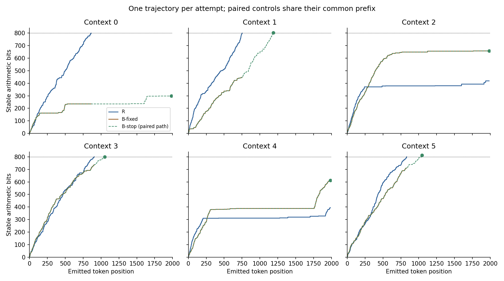
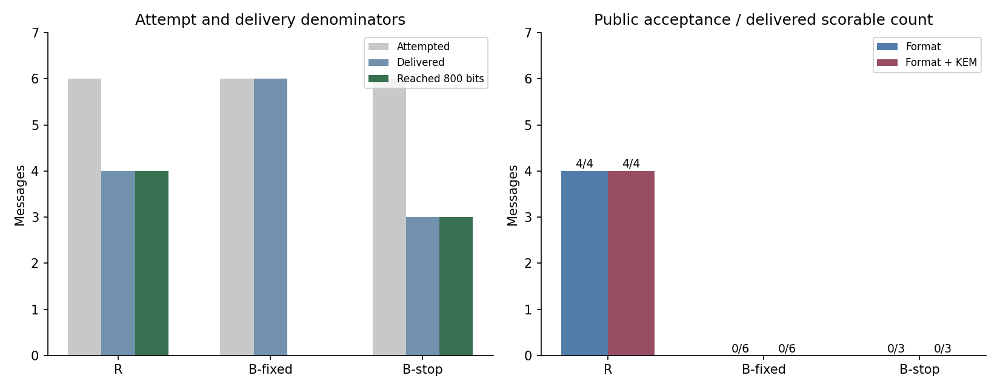
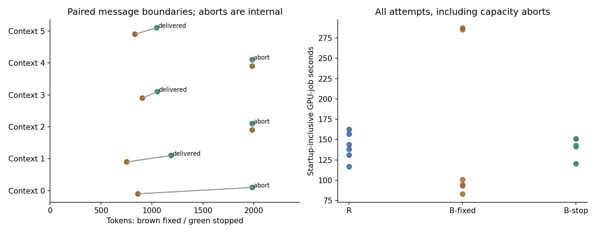

# Stage 9: stopping-rule and finite-packet recognition

**Completed on 19 September 2026: all 22 frozen jobs ran. R recovered 4/6 fresh 32-byte payloads, both independent receivers recovered exactly, B-fixed delivered 6/6 messages, and B-stop completed/delivered 3/6. Five capacity aborts were retained. No other execution failure occurred.**

Matching public first-completion stopping removed the completion/boundary rejection for delivered B-stop controls, as expected from their generator. It did **not** remove full format rejection in this sample: canonical midpoint replay rejected all 3 delivered B-stop messages. Local filler rejected 2/3; necessary KEM representation rejected 2/3. Their overlap is explicit, not treated as independent evidence. The prospective full-format false-positive counts are 0/6 B-fixed and 0/3 delivered B-stop, versus 4/4 sensitivity on delivered R messages. These counts do not establish reliable detection or a population-level effect.

The historical 938-token derived prefix passes full format, proving only that this public format is not an authentication test; it remains a retrospective example, excluded from prospective counts. The paper package recommends **proceeding to a narrowly scoped regular-paper draft about finite-message evaluation**, with novelty and submission sufficiency still subject to review. It does not support a broad concealment or arithmetic-versus-rank 16 tradeoff claim.

## Scope, starting state and implementation

Repository: [mantzaris/CalgacusPublicEncryption](https://github.com/mantzaris/CalgacusPublicEncryption), directly on `main`. Actual starting revision `5400c9bf7ff03e9d10a913674bbc8399bd4df7da`, clean working tree. Implementation, six new contexts, six independent TEST_ONLY recipient keys, SHAKE256 binary payloads, paired sampling seeds, observer/analysis definitions and all 22 reservations were committed before inference at **`a0e790647fe1b8dc052d9ac568b0733d25e309f7`**. The implementation commit was pushed during execution. No inference code/profile changes or outcome-dependent reductions occurred.

This stage adds public first-completion control generation and a decomposed observer; it does not change the arithmetic core, transport/receiver, HPKE, candidate rule, temperature or 1984-token ceiling. Explicit registered Stage 9 R32 profile changes only identity and public contexts. Public 100-byte envelope class is pre-agreed, bound in unchanged HPKE info/AAD; no on-wire size metadata. Fresh messages use new encapsulation/message-ID randomness. The six new contexts are not screened for capacity and all tokenize to nine context tokens including BOS. Context+carrier+one spare position=1994 within 2048.

[Study specification](docs/stage9_study_spec.md), [observer contract](docs/stage9_observer_contract.md), [allocation](artifacts/stage9/allocation.json), [summary](artifacts/stage9/summary.json), [cases](artifacts/stage9/cases.jsonl) and [manifest](manifests/stage9_evidence.json) connect the exact execution to source, profile, wire/partial bytes, compact traces, commands and ledger. Historical reports, profiles, stopped/completed statuses and experiment files remain unchanged. Earlier work is never pooled into Stage 9 prospective counts. All material is development evidence, not final held-out evaluation.

## Controlled stopping comparison

B-fixed and B-stop both sample unrounded temperature-one model probabilities over the unchanged canonical admissible 16. R and the control completion monitor use the unchanged positive integer frequencies totaling 65536. R stops when enough stable bits recover the finite packet, then its receiver verifies the public deterministic midpoint/replay constraints and authenticates HPKE. B-stop stops on **stable count>=800 alone**. It never calls canonical finish to choose output, tests KEM, authenticates, resamples or replaces a sampled token.

B-fixed emits the delivered R length, or 1984 on R abort. B-stop emits until first completion or internally aborts at 1984. Within each context the two controls use the same predeclared PCG64 seed and hence the same common sampling prefix, checked afterward on IDs, ordered-candidate hashes, frequency tables and stable decoder state. The seed is not a cryptographic key and is absent from observer inputs. A fixed-length message can be incomplete, stop exactly at first completion, or have trailing tokens; those outcomes are separate from its successful generation/delivery.

The public observer receives actual UTF-8 and public profile/context/model only. One metered full-message pass reconstructs all candidates/probabilities/tables. It reports strict UTF-8, canonical bytes, full membership, target reached, first position, exact message boundary, local filler, canonical integer replay and necessary KEM representation independently. Later predicates are explicitly unavailable when stable bytes cannot be recovered. Filler/replay/KEM concern the first-complete prefix even when the complete message has trailing tokens; exact-boundary acceptance remains separate. Empty released excess makes the local filler predicate vacuously true, not a substitute for canonical replay.

KEM tests the honest-output encoding convention `little_endian(enc)<2^255−19`, not curve validity, an HPKE tag or sender. Stable bytes can be inspected even when boundary/filler/replay fails. Format acceptance is not authentication or plaintext recovery. Neither generator is asserted equivalent to human traffic or the uniquely correct cover model.

## Historical public-table reanalysis and actual-text checks

All eight Stage 8 R-control tables were reprocessed. Six remain incomplete (stable counts 583,224,611,425,1036,531 at their actual original boundaries); two first complete before the original end. These statements are retrospective public-table analysis, not new receiver successes.

| Original Stage 8 control | Original tokens | First 800-bit prefix | Original boundary | Filler at prefix | Canonical replay at prefix | KEM at prefix | Derived actual-text result |
|---|---:|---:|---|---|---|---|---|
| `control-R-c1-n32-r0-B` |1984|1752|Trailing 232 tokens|Fail:801 stable bits, excess 0 rather than 1|Fail at 1752|Pass|Format rejects |
| `control-R-c3-n32-r0-B` |1783|938|Trailing 845 tokens|Pass:800 stable bits, no excess|Pass|Pass|Format and KEM accept |

Two fresh GPU observer jobs constructed these prefixes from original transmitted bytes and public tokenization, verified that the derived bytes are literal original-byte prefixes, and reconstructed the predictions from those actual bytes. Their outcomes match the trace-only analysis. No encoder trace, seed, key, ciphertext or private expected value enters the observer. Saved source hashes and derived carrier files link their provenance.

The 938-token derived snippet is a concrete public-format false positive for an unencrypted sampled prefix. It was selected retrospectively, not sampled as a new independent control or transmitted in the original Stage 8 study. The 1752-token example shows that matching the boundary does not automatically satisfy deterministic packet constraints. Neither changes the original eight controls' outcomes.

## Prospective outcomes

| Group | Attempted | Reached 800 stable bits | Delivered / scorable | Exact authenticated | Capacity aborts |
|---|---:|---:|---:|---:|---:|
| Fresh R32 |6|4|4 /4|4|2|
| B-fixed |6|0|6 /6|Not tested|0|
| B-stop |6|3|3 /3|Not tested|3|
| Independent receivers |2|2|2 repeated carriers|2|0|
| Historical-prefix observers |2|2|2 derived snippets|Not tested|0|

The four R carriers contain 862,752,905 and 832 tokens in contexts 0,1,3,5. Contexts 2 and 4 stop at 1984 with only 419 and 395 stable bits, respectively. No partial result is authenticated payload recovery. The two fresh receiver processes take the saved UTF-8, public configuration and TEST_ONLY private key; hash comparisons occur in the controller. Both exactly recover their fixed context 0/context 3 source payload. Receiver IDs, ranks, tables and interval states are compared with the source **afterward**, never provided as receiver inputs.

| Context | R result | B-fixed tokens / stable bits | B-stop emitted / stable bits | B-stop boundary | Filler | Replay | KEM |
|---|---|---|---|---|---|---|---|
|0|Exact,862 tokens|862 /235|1984 /299|Internal abort|NA|NA|NA|
|1|Exact,752 tokens|752 /449|1186 /803|First completion|Fail|Fail|Pass|
|2|Capacity|1984 /658|1984 /658|Internal abort|NA|NA|NA|
|3|Exact,905 tokens|905 /735|1052 /801|First completion|Pass|Fail|Fail|
|4|Capacity|1984 /613|1984 /613|Internal abort|NA|NA|NA|
|5|Exact,832 tokens|832 /711|1044 /814|First completion|Fail|Fail|Fail|

All six paired controls match exactly over their common prefix:862,752,1984,905,1984,832 tokens. The three completed B-stop messages extend their paired B-fixed outputs; no prospective fixed control reached its first-complete prefix within its original boundary. Thus **no prospective pair flips full format acceptance**: incomplete fixed controls become either internal B-stop aborts or completed but noncanonical packets. The historical 938-token example supplies the boundary-only full-verdict flip, at its explicitly retrospective scope.



### Predicates and conditional denominators

Every delivered prospective message is strict canonical UTF-8 and entirely inside admissible support. No special-token repair, normalization, resampling, candidate exhaustion or serialization drift occurred. All 6 B-fixed messages are incomplete; they have no trailing-token rejection and no available filler/replay/KEM predicate. All 3 delivered B-stop messages end exactly at first completion; none is incomplete or trailing on the wire. Three other B-stop attempts abort internally and are not scored as traffic.

Define a **completion-and-boundary test** as stable target reached AND end at that first prefix. Its control acceptance changes from 0/6 delivered B-fixed to 3/3 delivered B-stop; this is a deterministic consequence of the B-stop contract, not a newly discovered detector property. The full format additionally requires filler and canonical replay. It accepts 4/4 delivered R,0/6 B-fixed and 0/3 delivered B-stop. On the all-attempt scale, B-stop completes 3/6 but generates 0 format-accepted deliveries; the other three are aborts, not rejected wire messages.

The three B-stop packets release 3,1,14 excess stable bits. Local filler passes only context 3, while canonical replay fails all 3, first diverging at token 1182,1052,1020, respectively. This directly shows that a passing local filler prefix is weaker than canonical replay. KEM passes only context 1; it contributes no extra rejection to a full-format test that already rejects all three. It cannot authenticate a tag. Public predicate false-positive counts describe this small diagnostic sample only. Zero observed full-format false positives does not imply zero general false-positive probability; the separate historical accepted snippet is an explicit counterexample to treating format as proof of ciphertext.



### Complete-message scores and cost

Against B-fixed, four delivered matched R/control context pairs give higher-is-R canonical-token-surprisal AUC 1.0; mean-log-rank and admissible-surprisal AUCs are also 1.0. Token-count AUC is 0.5 by length matching; UTF-8-byte-length AUC is 0.625, with cluster interval [0.25,1]. The surprisal interval [1,1] reflects sample separation, not perfect population detection;1998/2000 context bootstrap draws have available pairs and two are undefined. This differs from Stage 8's0.5 R-surprisal AUC on two different delivered messages. Neither stage is pooled or relabelled, and neither estimates a general arithmetic security advantage.

Only three R/B-stop pairs are delivered. Following the frozen rule, **no B-stop AUC is reported**. Their raw canonical-token surprisals in contexts 1,3,5 are R1.1131/0.9052/0.9943 versus B-stop 0.7027/0.7730/0.7962 bits/token. R is shorter in all three pairs:752/905/832 versus 1186/1052/1044 tokens. The signs, including negative length differences, remain unchanged. These are neither length-matched traffic samples nor evidence of a length-independent score effect. Scores refer to canonical token paths, not exact probabilities of UTF-8 strings. All raw scores and paired differences are retained in [tables.md](artifacts/stage9/tables.md) and [recognition.json](artifacts/stage9/recognition.json).

R successful-message mean useful rate is 0.306994 payload bits/token; failure-inclusive attempt mean is 0.204662. Recovered payload bytes per startup-inclusive encrypted-job second is 0.150662, including the two failed sends. These rates concern 256 useful bits inside an 800-bit envelope. B-stop completes an unencrypted public packet target, not a useful application payload.

| Group | Mean whole job seconds, all attempts | Mean encoding/generation seconds | Mean public-scoring seconds / actual passes |
|---|---:|---:|---:|
| R |141.5975|73.7369|39.6502 /4|
| B-fixed |157.4314|70.5459|71.5143 /6|
| B-stop |137.8852|93.9481|56.5812 /3|

Public-scoring means condition on delivered/scored messages; whole-job means include aborts, loading and all actual passes. The independent receivers cost 56.0155 and 58.1273 seconds including startup. Integer-frequency versus unrounded-probability maximum per-step TV over prospective scoring is 0.0002383393; mean per-message TV is 0.0001992042 R,0.0002113553 B-fixed,0.0002061562 B-stop. Small local rounding differences are not a guarantee of equal complete-message distributions.

Context resampling gives descriptive completion intervals R [1/3,1] and B-stop [1/6,5/6]. B-fixed's all-incomplete interval collapses to [0,0]; that is not a population guarantee. The six contexts share a short note template and are manually chosen without screening, not random draws from human traffic. One key and one payload per context confound these factors, while paired controls remain dependent. No token-level, replay or historical-prefix pseudoreplication is used.



### What is established and unresolved

- **Established here:** stopping-rule rejection and finite-packet consistency are different mechanisms. First-completion controls eliminate the former on delivered messages while all three retain canonical replay failure. All six common prefixes reproduce; exact R reception survives in 4/6 fresh attempts and 2/2 fixed independent replays.
- **Established retrospectively:** of two old trailing controls, one derived first-complete prefix still fails midpoint/replay; the other passes full format and KEM. Original Stage 8 results remain unchanged.
- **Expected from definitions:** B-stop's successful message boundaries match its public stopping rule. Canonical midpoint constraints are properties of our adapted finite packet code, not new arithmetic principles.
- **Unresolved:** how frequent each mechanism is in a wider channel; whether stopping matching weakens full-format recognition in a population; any broad F/R rate-recognition tradeoff, human-traffic concealment, sender authentication or robustness. Three delivered controls and four genuine messages cannot establish those claims. No universal attack follows from public inversion.

The strongest defensible contribution is a **reproducible, bounded empirical separation of capacity aborts, public stopping boundaries and finite-packet conformance under an actual-text contract**. It is supporting evidence for a narrow case-study paper, not a new secure construction. The closest papers already establish arithmetic probability matching, stepwise tokenization verification and variable-entropy/security issues. The [blueprint](paper/PAPER_BLUEPRINT.md) identifies those objections and recommends a scoped draft with a claim-by-claim review before any submission decision; no further experiments are automatically prescribed.

## Verification and resources

Six focused Stage 9 checks passed in 0.28 seconds before GPU freeze: independent uniform/changing-table bit expectations, pending underflow, overshoot versus canonical finish, incomplete/trailing and bounded-progress examples, public-only observer interface/unrounded sampling, changed-profile identity and full-allocation/suballocation protections. Historical cryptographic/arithmetic checks retain their original source revisions. No broad suite, CPU model inference, benchmark, detector training or dependency/environment rebuild ran. Vocabulary-only tokenizer checking made no eval calls; its backend emitted a context metadata warning, retained in the log, which is not a model-inference run.

Rediscovery selected **NVIDIA RTX 5000 Ada Generation**,32760 MiB, driver 590.48.01, UUID`GPU-10d1f16f-9e79-08bb-b2ba-3353c04422cf`. The other attached Quadro T2000 is unused. Model remains Meta-Llama-3-8B-Instruct Q4_K_M with SHA256`86c8ea6c8b755687d0b723176fcd0b2411ef80533d23e2a5030f845d13ab2db7`, tokenizerSHA 256`5c8950bef385be95db5feda8c8afadba6a5c0b903e6ceaa39efe6cfe3d84f3f3`. Reused llama-cpp-python 0.3.23, NumPy 2.2.6, CUDA runtime 12.4.127/cuBLAS 12.4.5.8; complete dependency/native hashes and runtime flags are in the environment record. Float32 logits, f16KV, batch 1, full cache reset and 33/33 GPU layers remain fixed.

Full reservations for 22 potential jobs total 8400 seconds,96000 evaluated tokens and 22 cases. This fits Stage 9 caps 8640/120000/32 and the starting parent remainder 8789.737366440/218107/81 without assuming capacity failures save resources. Stage 9 is a subset of the existing parent, not an added lifetime allocation. The Stage 8 remaining suballocation is overlapping and never added. Lifetime ceilings stay 21941.884885363 seconds/424994 tokens/342 cases.

Startup, imports, loading, prompts, generation, receiver/public scoring, host tokenization during jobs and shutdown are charged. Shared ledger lock, persistent reservations, worker leases, phase meter, PID-matched GPU samples and deadlines remain enforced. All attempts and failures are retained; no discretionary retries, new thresholds, sample replacement or extra investigation jobs are scheduled.


### Final accounting and evidence checks

| Scope | GPU-job seconds | Evaluated tokens | Attempts |
|---|---:|---:|---:|
| Stage 9 starting lifetime |13152.147518923|206887|261|
| **Stage 9 actual** |**2927.091878852**|**45988**|**22**|
| **Lifetime actual** |**16079.239397775**|**252875**|**283**|
| Remaining parent allowance |5862.645487588|172119|59|
| Unused Stage 9 subset |5712.908121148|74012|10|

The last two rows overlap and must not be added. All 22 intended slots ran; no replay substitution or investigation/retry slot was used. Ten unallocated Stage 9 ceiling slots remain unused. Five failures are capacity exhaustion: two R sends and three B-stop controls. Rejected public predicates on successfully delivered controls are not runtime failures or HPKE authentication failures.

Phase token totals: encoding 7373, probability-weighted admissible-control generation 16661, R reception 3387, public scoring 16782, fresh receivers 1785, sum 45988. There were no unmetered warmups or other inference jobs. All 22 worker PIDs match the specified GPU and 33/33-layer offload; all leases, source/profile/window checks, phase sums and clean exits pass. Peak sampled process VRAM is 5006 MiB, a sampled maximum rather than an absolute peak.

[Host reconciliation](artifacts/stage9/analysis_output.txt) independently reconstructs interval progress and source packet prefixes from recorded integer tables, checks public/generator table agreement, all six paired trajectories and both independent receiver traces, and reconciles every reservation/settlement. It verifies the original 140909-byte ledger prefix hash and 2646 historical artifact/profile/codec files unchanged. The new observer does not retroactively replace the old Stage 8 observer or its outcomes. All intended source and runtime files are hashed by the evidence manifest. GPU work is stopped; host analysis/figures/documentation are later work, not new GPU-tested revisions.

## Reproduction commands and stopped state

```bash
.venv/bin/python artifacts/stage9/reanalyze_history.py
.venv/bin/python scripts/prepare_stage9.py
.venv/bin/python -m pytest -q tests/test_stage9.py
.venv/bin/python scripts/run_stage9.py --allocation-check
.venv/bin/python scripts/run_stage9.py
.venv/bin/python artifacts/stage9/analyze.py
.venv/bin/python artifacts/stage9/tables.py
MPLCONFIGDIR=/tmp/stage9-mpl ../llm-rankcloak/.venv/bin/python artifacts/stage9/plot.py
```

Preparation and GPU commands are historical execution provenance, not permission to rerun a completed allocation. Frozen-input/status guards reject regeneration/restart. Do not remove them or reset the ledger. The host analysis/plot commands consume saved records only. The separate [paper blueprint](paper/PAPER_BLUEPRINT.md) and [claim matrix](paper/CLAIM_EVIDENCE_MATRIX.md) provide the proposed argument, source-specific limits and official venue schedule; no finished manuscript or submission is produced.
